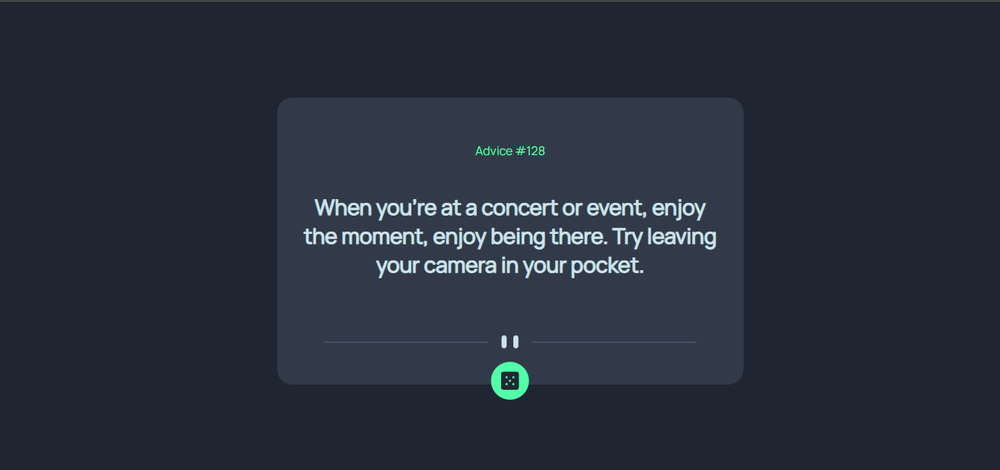

# - Advice generator app

## Table of contents

- [Overview](#overview)
  - [The Project](#the-challenge)
  - [Screenshot](#screenshot)
  - [Links](#links)
- [My process](#my-process)
  - [Built with](#built-with)
- [Author](#author)

## Overview

### The Project

Users should be able to:

- View the optimal layout for the app depending on their device's screen size
- See hover states for all interactive elements on the page
- Generate a new piece of advice by clicking the dice icon

### Screenshot

### Links

- Solution URL: [solution URL](https://github.com/Arum-Favour/Advice-generator-App.git)
- Live Site URL: [live site](https://arum-favour.github.io/Advice-generator-App/)

## My process

### Built with

- Semantic HTML5 markup
- CSS custom properties
- Flexbox
- CSS Grid
- Mobile-first workflow
- [Styled Components](https://styled-components.com/) - For styles

## Author

- Website - [Arum Favour](https://arum-favour.github.io/My-Portfolio/)
- Frontend Mentor - [@kingsxn](https://www.frontendmentor.io/profile/Kingsxn)
- Twitter - [@kvngfx](https://www.twitter.com/kvngfx)
